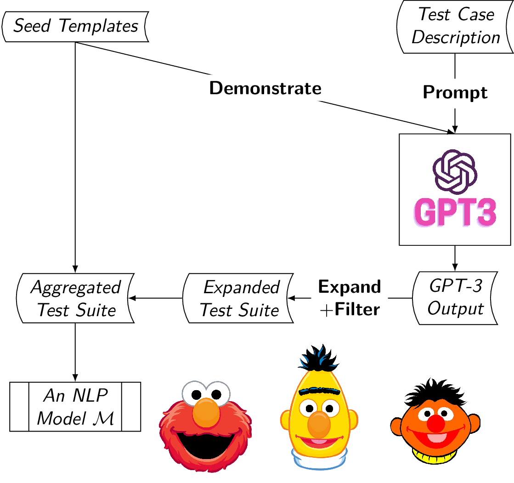
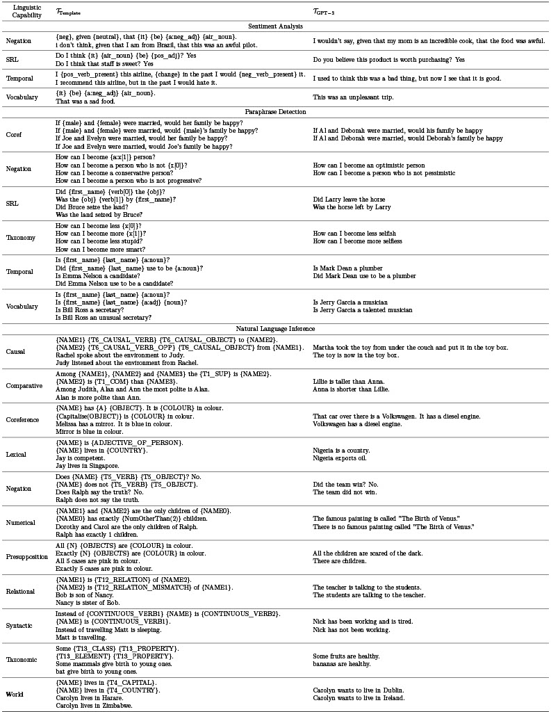

# Overview

TestAug is a framework that augments the template-based test suite to better test NLP models' linguistic capabilities.

The framework is best described in the diagram shown below:
- Step 1: Specify the linguistic capability one would like to test. For example, the capability of handling negation for a sentiment classifier $\mathcal{M}$.
- Step 2: Use samples from an existing template-based test suite as demonstrations to elicit GPT-3 for test case generation. 
- Step 3: Filter the invalid test cases.
- Step 4: Augment the template-based test suite to test the classifier $\mathcal{M}$ for its linguistic capability in question.
- Step 5 (Optional): Complement the existing template-based test suites with new templates generated from GPT-3.



Currently, TestAug system supports NLP tasks including sentiment analysis, paraphrase detection, and natural language inference. 

# Test Suites

## Preview, Statistics, and Download Links

The statistics and download link for our GPT-3 test suites are shown below.

| Task                       | Linguistic Capabilities | Size | Download                              |
| -------------------------- | ----------------------- | ---- | ------------------------------------- |
| Sentiment Analysis         | 4                       | 1607 | [`sentiment.pkl`](data/sentiment.pkl) |
| Paraphrase Detection       | 6                       | 1916 | [`qqp.pkl`](data/qqp.pkl)             |
| Natural Language Inference | 17                      | 2942 | [`nli.pkl`](data/nli.pkl)             |

Some samples of the test cases are shown below. We could see that many of them are substantially different from the test cases from the template-based test suites (see our paper for more details).



## Usage

These test suites are readily used in your custom code following.

```python
import pandas as pd

# load one of our test suites
test_df = pd.read_pickle("sentiment.pkl")

# load your custom model 
clf = ...

# record prediction
test_df = test_df.assign(pred=clf.predict(test_df.text.tolist()))

# compute overall error rate
err = (test_df.label != test_df.pred).sum() / len(test_df)
print(f"The overall error rate is {err:.3f}.")

# compute the per capability error rate
test_df = test_df.assign(error=test_df.label != test_df.pred)
print("The per capability error rate is shown below:")
print(test_df.groupby("capability").error.mean())
```

If you would like to reproduce our experiments in Table 3 and Table 10. Please refer to our paper together with the [CheckList](https://github.com/marcotcr/checklist) and [LoNLI](https://github.com/microsoft/LoNLI) repositories.


